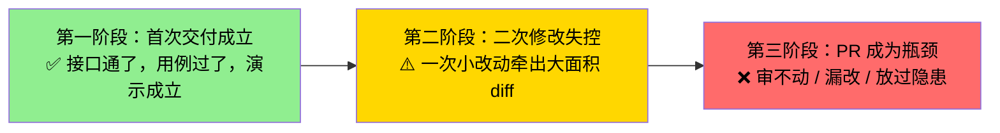
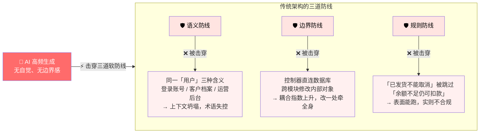
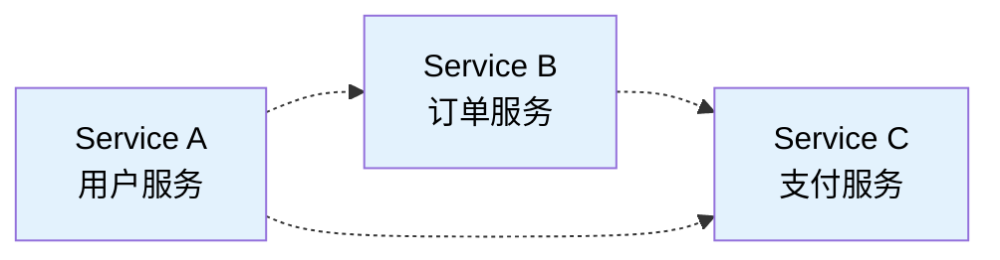
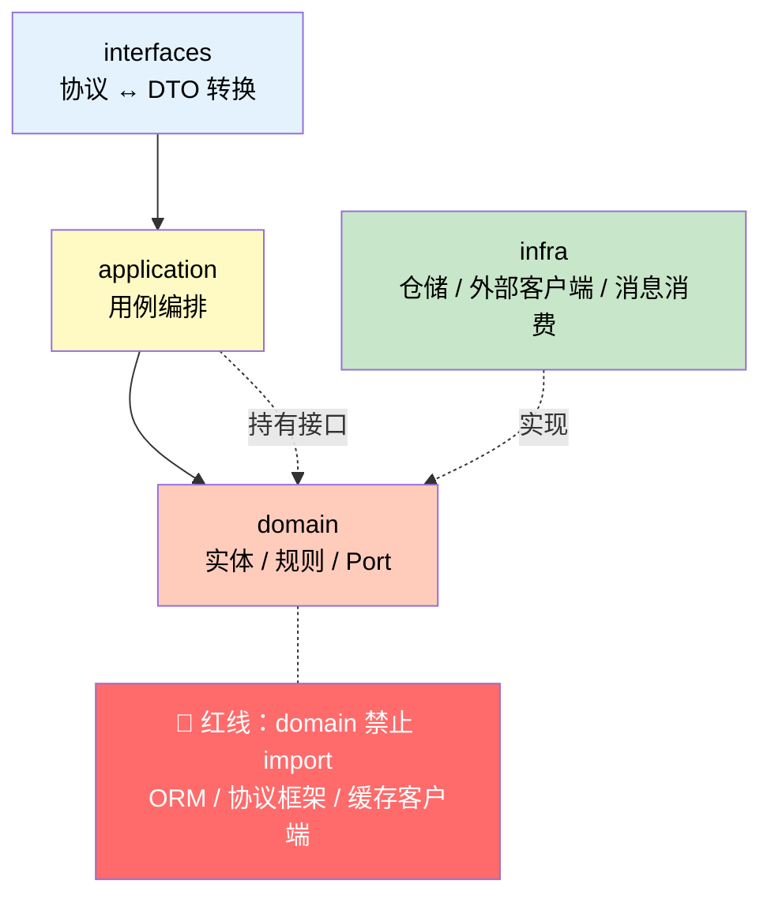
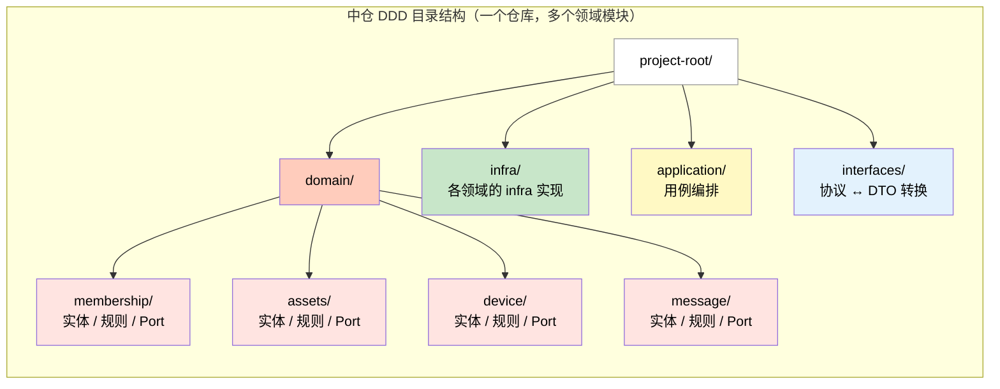
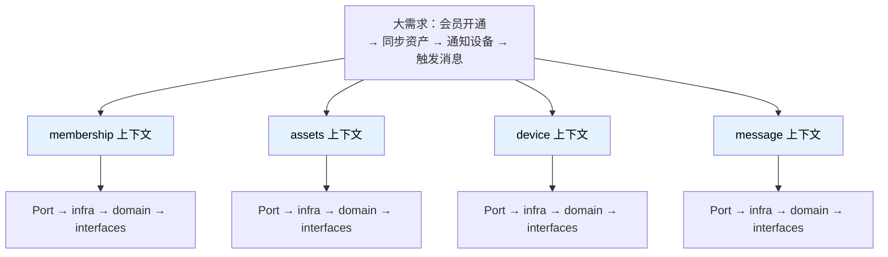
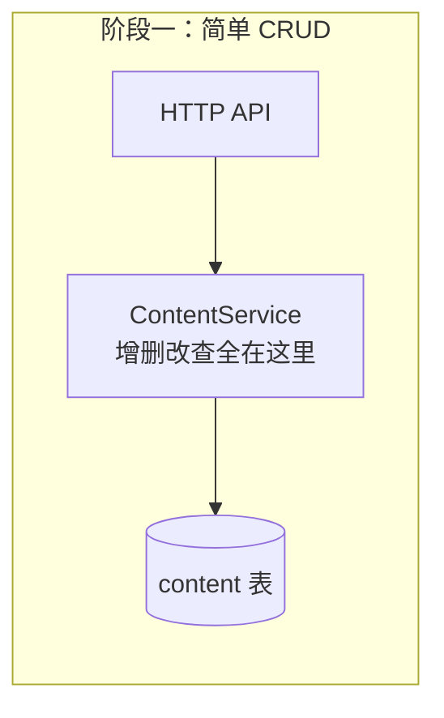
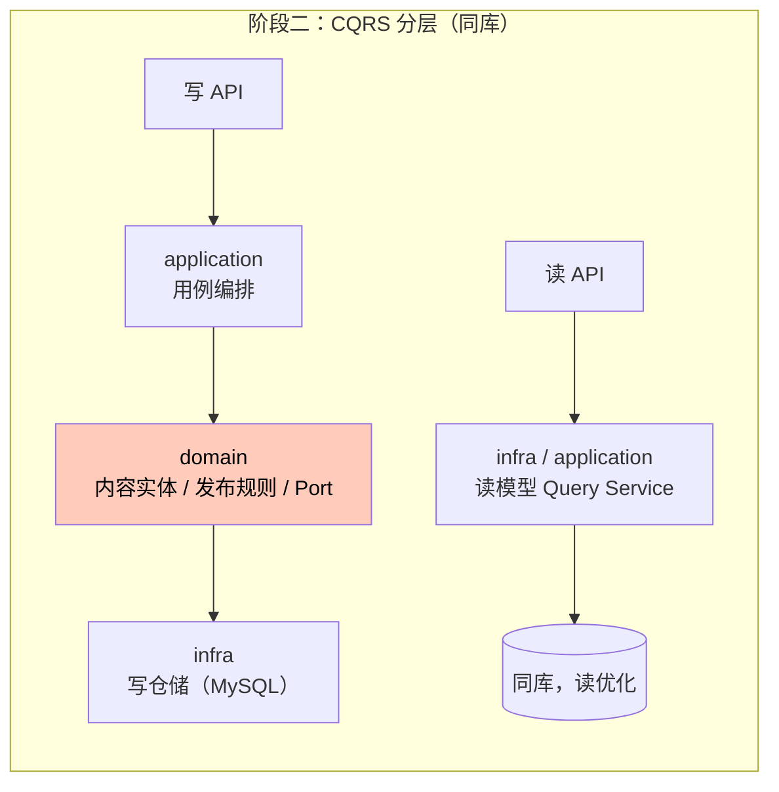
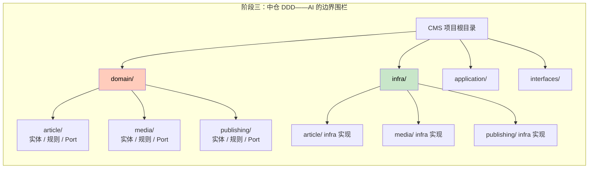
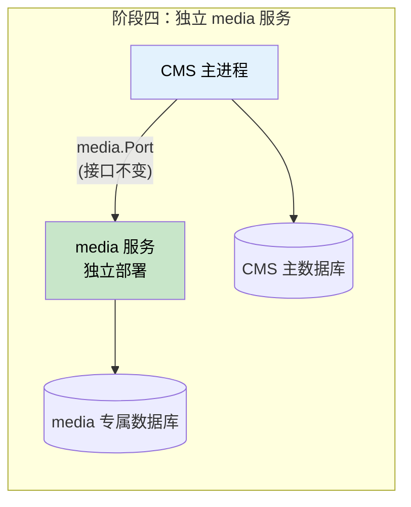

# Vibe Coding 时代的软件架构：为什么 DDD 是能兜住底的护栏

> 技术白皮书 · 2026 · v2（重构版）
>
> 姊妹篇：《DDD 的核心优势：为复杂业务系统买的三份保险》（`ddd-core-advantages.md`）——剥离 AI 语境，单讲 DDD 的独立价值与通用落地清单。本文只讲一件事：**DDD 在 Vibe Coding 中解决了什么别的架构解决不了的问题。**

---

## 摘要

AI 编程工具（Vibe Coding / Agentic Programming）大幅提升了代码生成速度，但同时也加速了技术债的累积。传统架构依赖人工自觉维护的三道防线——语义一致性、模块边界、业务规则合法性——在高频 AI 生成下被迅速击穿。

本文从工程实践出发，分析 MVC 三层、微服务、DDD 四层三种架构在 AI 编码语境下的表现差异，通过代码示例论证分层架构如何约束生成行为、降低审阅成本，并给出轻量级落地建议。

**核心结论**：Vibe Coding 决定系统能跑多快；清晰的语义边界与结构约束决定系统能跑多远。DDD 是实现这一目标的有效路径之一，但不是唯一路径——Clean Architecture、精心维护的分层架构同样可以做到。关键在于：无论用什么方法论，都需要给 AI 的生成行为套上结构缰绳。

---

## 1. 问题背景：首次能跑 ≠ 后面改得动

### 1.1 Vibe Coding 的生产力红利

AI 编程工具的普及，让自然语言驱动代码生成成为主流生产方式。功能迭代速度被提升数倍甚至十倍。Martin Fowler 将"几乎不看生成代码、凭感觉连改带跑"的模式定义为严格意义上的 Vibe Coding，而将"人定意图、AI 写实现、人审 diff"的模式称为 Agentic Programming [1]。本文讨论的是后一种——已经用 AI 主力写代码、却仍要对可维护系统负责的生产场景。

### 1.2 三段式失控曲线

生产实践表明，AI 驱动的开发往往呈现一条三段式时间线：



**第一阶段：首次交付成立。** 对话把需求说清楚，模型把链路写通，业务规则、外部调用、协议拼装可以暂时堆在同一个大 Service 里。功能验证通过，团队容易产生"已经做完了"的错觉。

**第二阶段：二次修改失控。** 需求微调或外部接口变化时，模型缺乏稳定落点，倾向在最近、最大的文件里继续加、继续重写。循环调用、分支判断与字段转换和业务规则缠在一起，一次小改变成大面积 diff。与此同时，先前生成留下的重复实现会把"改一处"变成"改一串"。

**第三阶段：PR 成为瓶颈。** 即便合并前功能仍然正确，人工审查也要在噪声里打捞真正的业务变更，核对多处重复逻辑是否都改到了。审不动，就会要么放过隐患，要么反复打回重生成——两者都在消耗 AI 本该省下的时间。

### 1.3 重复问题的放大效应

AI 写出来的实现里，同一段校验、同一套状态判断、同一种外部调用拼装，经常以轻微变体复制到多处。功能第一次仍然成立，因为每一处"各自能跑"。真正的成本出现在变更时：规则一变，就要同步改很多地方；地方一多，总有改漏——漏掉的那一处往往要到联调、甚至线上路径才暴露。

重复不是"代码丑一点"的审美问题，而是把每一次业务演进都放大成多点齐改，并把漏改变成高概率事件。

### 1.4 根本原因

问题的根源往往不是模型不够聪明，而是沿用了几十年的架构范式，从设计之初就是为"有自觉的人写代码"准备的。当生产主体大量转向大模型，架构的核心使命已经悄然改变：**它不再只是指导人如何实现功能，而是约束生成过程不要突破复杂度底线。**

### 1.5 AI 的第一目标是"让功能能跑"，不是"保护代码结构"

**AI 写代码时，首要目标是解决问题，而不是保护代码结构。**

这不是模型的 bug，是模型的 feature。大模型被训练成"把当前指令完成得最好"：你让它加一个字段，它就把字段加上；你让它改一个逻辑分支，它就改掉。至于这个改动会不会破坏原有的分层结构、会不会让模块边界变模糊、会不会引入重复——这些不是它的优化目标。它的优化目标是：**改完之后，这段代码能跑、能通过当前的测试。**

这就导致一个典型的"按下葫芦起了瓢"的现象：你让 AI 修一个 Bug，它修复了当前路径上的问题，但顺手引入了另一条路径上的新 Bug，或者在修复过程中把之前保持得还算清晰的结构给推倒了。因为在它看来，**代码结构是手段，让功能能跑才是目的**——如果牺牲结构能让它更快地达到目的，它会毫不犹豫地牺牲。

就像盖房子。AI 的首要任务是"把墙砌起来、把屋顶盖上"，至于地基有没有打好、承重墙的位置对不对——等出问题再说。但问题在于，地基没打好的房子，盖到三楼就开始裂缝；盖到五楼可能就塌了。AI 写代码也是同理：前几轮生成看起来一切正常，但随着代码量增加、改动次数增多，结构持续劣化，每一次"能跑"的新改动都在抬高下一次改动的复杂度。Bug 越来越多，每次修复的成本越来越高，直到某次修改彻底失控。

这解释了为什么在 AI 编码的语境下，架构的"约束"价值远大于"指导"价值。传统的架构文档告诉开发者"你应该怎么做"；AI 时代的架构必须告诉模型"你不能怎么做"。前者靠自觉，后者靠结构。**没有结构约束的 AI 编码，就像在地基没打好的土地上盖高楼——不是能不能的问题，是什么时候塌的问题。**

---

## 2. 三道被击穿的软防线

Vibe Coding 把开发者从编码执行者推向意图表达者与结果验证者。生产力被释放的同时，传统架构依赖人工自觉维持的三道防线也被击穿。



### 2.1 语义防线：概念一致性失控

自然语言天然带有歧义。同一个"用户"，可能指登录账号、客户档案或运营后台账号；同一个"订单"，可能指交易单、发货单或退款单。人工开发时尚可依靠评审与口耳相传维持相对统一；AI 只基于当前对话上下文给出实现，几轮迭代后，同一概念往往演化出多种字段命名与判断口径，上下文悄然坍塌。

### 2.2 边界防线：模块耦合指数上升

传统边界很大程度上依赖职业素养——清楚什么代码该放在哪，不随意跨模块调用内部逻辑。AI 没有这种边界感，生成逻辑永远是局部最优：控制器直连数据库，跨模块修改另一领域的内部对象，业务逻辑散落在工具类与配置的各个角落。没有强制约束时，每一次生成都在抬高系统耦合。

### 2.3 规则防线：业务合法性无人兜底

"已发货不能取消""余额不足不能扣款"——规则散落在各处时，人工开发也会疏漏。AI 更倾向功能先可用：直接改字段、跳过校验，制造大量表面能跑、实则不合规的代码。这类问题隐蔽性强，简单功能验证很难发现。

**传统架构中的大量约束是软规范，靠人自觉遵守；AI 没有"自觉"。非强制性的规范，会在高频生成中被迅速击穿。**

---

## 3. 三种架构模式对比分析

落到工程里，常见的三条路是：按功能拆成多服务（小仓）、进程内套 MVC 三层（handler→service→DB）、以及 DDD 四层（interfaces→application→domain←infra）。三者管控复杂度的方式差别很大。

### 3.1 MVC / 三层架构


MVC 及延伸出的三层架构按技术职责划分表现、业务与数据，结构简单、门槛低。其边界是技术维度的，而非业务维度的。

**在 AI 编码语境下的表现：**

- 目录扁平，规则散落在 handler 与 service
- service 直绑 gorm、RPC 与中台
- 循环调用对方、重试与协议细节常和业务揉在一起
- 概念漂移几乎无阻，贫血模型下规则易被绕过
- 一次改动易牵多处，没有编译级护栏
- 漏改往往拖到联调甚至上线

**适用场景**：小型工具、一次性项目与生命周期极短的原型。

### 3.2 多服务 / 微服务架构



多服务、微服务通过进程或仓库拆分系统，天然带有物理边界。

**常见误区**："拆了微服务就等于做了 DDD"。

**在 AI 编码语境下的表现：**

- **AI 不知道自己在哪个服务里。** 你让 AI 改订单服务的某个接口，它可能顺手在订单服务里直接修改用户服务的数据库表——因为上下文里刚好有用户表的 schema。编译不会报错（各服务独立部署），测试也未必覆盖到这条跨服务路径。这类"看着能跑"的越界代码，人工审查时几乎不可能发现，除非审查者脑中装着所有服务的 schema 映射。
- **一次需求串 3-5 个仓库，AI 记不住全部。** 一个"用户开通会员→更新资产→通知设备→推送消息"的需求横跨 membership / assets / device / message 四个服务。AI 在一个会话里只能看到当前仓库，改完第一个就要切上下文。漏改一处的接口字段，本服务编译通过，等到跨服务联调才暴露——而联调环境的搭建和排错时间远大于本地编译报错。
- **AI 生成的跨服务调用协议不匹配。** 让 AI 在 A 服务里调用 B 服务的接口，它可能生成 A 传了 3 个参数，但 B 服务实际定义只接受 2 个；或者 A 用 JSON 格式发送，B 期待 protobuf。这种不匹配在单体里编译期就能拦住，跨服务后要跑到集成测试甚至预发环境才暴露。
- **每个服务内部仍然是贫血 MVC。** 微服务只切了进程边界，没切业务语义。服务内部还是 handler 直调 DB、业务逻辑散落在各处。AI 在每个小服务里照样可以写出"已发货还能取消"的非法状态——微服务的物理围栏拦不住服务内的逻辑烂。
- **服务按表拆分，概念跟着表走，而非按业务语义。** 用户表拆一个服务、订单表拆一个服务——AI 生成时看到的"用户"只是数据库字段的映射，而不是业务概念。同一个"用户"在 user-service 里是登录账号，在 order-service 里变成客户档案的 ID 引用，概念漂移在微服务间更隐蔽，因为各服务有自己的数据副本和字段定义。

**核心局限**：微服务的物理边界拦住了跨进程的乱调用，但拦不住 AI 在单个服务内部的语义腐化。边界是进程级的，不是语义级的。AI 在进程内写烂代码的能力，微服务管不了。

### 3.3 DDD 四层架构



DDD 的核心不是一上来堆砌聚合根与领域事件，而是按业务语义划分边界、用通用语言统一认知、以领域模型与端口收口规则及外部适配。工程落地常见形态是四层依赖：`interfaces → application → domain ← infra`。

各层职责：

- **Interfaces**：只做协议与 DTO 转换，不写业务
- **Application**：编排用例，不做决策
- **Domain**：收口实体、规则与 Port——纯业务意图，不绑定任何框架
- **Infrastructure**：实现 Port——仓储、外部客户端、消息消费

依赖方向只指向内：domain 不知道外面用的是什么框架，外面必须实现 domain 定义的接口。

### 3.4 三栏对比

| 维度 | MVC 三层 | 多服务（微服务） | DDD 四层 |
|------|---------|----------------|---------|
| 领域边界 | 目录扁平，规则散落 handler/svc | 靠进程/仓库，跨仓易漏改 | `domain/<name>` 收口规则与实体 |
| 改动落点 | 改一处易牵多处，无编译护栏 | 一次需求串多仓、多发布 | 同领域有明确落点；跨领域走接口 |
| 依赖方向 | svc 直绑 ORM / RPC / 中台 | 服务互调易成环 | domain 定义 Port，infra 实现 |
| 协议与业务 | handler 易把业务写进协议层 | 各仓各套协议 | interfaces 只做协议↔DTO |
| 适配与业务 | 循环调对方、重试常和业务揉在一起 | 各仓各自包一层，难复用 | 对方能力差异收口 infra；domain 只表达意图 |
| 人工审阅 | 一层文件里业务与 IO 混杂，难扫 | 跨仓对照，边界靠约定 | 按层核对：domain 无框架、infra 无业务规则 |
| AI / 编译防漏 | 漏改常到联调/上线才暴露 | 跨仓难以一次构建验全 | 接口未实现、误引框架、字段未同步 → 本地即失败 |
| AI 改动粒度 | 易在同一 svc 里堆嵌套逻辑 | 一次需求跨多仓，难分步 | 按层分面（Port→infra→domain），单次 diff 可控 |

**一句话总结**：AI 越自由、越快，越需要清晰的语义边界来兜底。DDD 不是限速牌，而是赛道——它不阻止跑得快，只是避免冲出跑道。

---

### 3.5 过度拆分微服务 vs 中仓 DDD：Vibe Coding 时代的路线选择

上面的三栏对比揭示了一个更深层的问题：当微服务被拆得过细——一个团队每人维护几十个服务——带来的新痛点比解决的问题还多。在 Vibe Coding 的语境下，这些痛点被进一步放大。

#### 3.5.1 过度拆分微服务的弊端

**漏改风险不降反升。** 微服务的核心承诺是"每个服务独立演进"，但当一次需求横跨多个服务（例如"用户开通会员→更新资产账户→触发通知→推送消息"），改动必须在多个服务的代码库中同步进行。AI 无法在一次会话中看到所有服务的完整上下文，漏改一处，服务间的接口不匹配要等到联调甚至上线才会暴露。与 MVC 三层中的"漏改同文件"不同，跨服务漏改的发现成本更高——编译时不会报错，测试覆盖不全就查不出来。

**一人维护几十个服务的认知负荷。** 每个服务虽小，但各自的部署配置、依赖版本、CI 流程、监控面板、数据库 schema 都要维护。一个人脑中同时装着 20 多个服务的拓扑，每次需求变更要先回忆"改哪几个服务、各自什么版本、接口兼容性如何"。AI 生成代码时也无法利用完整的项目结构信息，因为上下文窗口被多个独立仓库切碎了。

**AI 生成的边界溢出更隐蔽。** 微服务的物理边界在进程层面，但 AI 在生成代码时看不到进程边界——它会在一个服务里直接调用另一个服务的内部 API、假设数据结构一致、绕过防腐层。这些"看起来能跑"的跨服务耦合在代码审查中极易被忽略，因为审查者脑中也没有完整的 20 个服务接口映射。

**小服务的"贫血问题"。** 每个服务拆得极小后，服务内部几乎没有业务逻辑，只是 CRUD 加转发。业务规则散落在多个服务的编排层、消息处理、配置中心里。AI 要理解一条完整的业务链路，需要在多个仓库之间拼图，这恰恰是它最不擅长的。

#### 3.5.2 中仓 DDD 方案的优势



**一次构建验全。** 所有领域模块在同一个仓库、同一个构建单元内。AI 可以在一棵目录树下看到完整的领域模型、Port 接口与基础设施实现。跨领域改动时，编译会立即报错：接口未实现、字段未同步、依赖方向错误——失败停在本地，不必拖到跨服务联调。

**逻辑边界，物理一体。** 中仓 DDD 通过 `domain/<name>` 目录划分限界上下文，通过 Port 与依赖倒置确保领域间只通过接口交互。物理上它们在同一进程，不需要网络调用、序列化、服务发现——减少了大量基础设施噪音，也让 AI 生成的代码更聚焦于业务逻辑本身。

**认知负荷大幅降低。** 维护者面对的是一个仓库、一个构建系统、一套部署流程。需要理解的是领域之间的语义关系，而不是 20 多个微服务的部署拓扑。AI 的上下文窗口可以覆盖完整的领域模型，而不是被切碎在多个仓库之间。

**Vibe Coding 的天然适配。** AI 生成代码时，中仓 DDD 的目录结构本身就是导航：`domain/user/port.go` 告诉它用户领域的接口契约在哪里，`infra/profile_fetcher.go` 告诉它基础设施的实现应该放哪。一次生成会话可以覆盖完整的一个功能链路，而不会因为仓库边界被截断。

**但中仓不是无限大的。** 必须坦诚地说：一个仓库不可能无限膨胀。当业务复杂度增长到几百个领域模块、上千万行代码、几十个团队在同一棵目录树下协作时，单一仓库的构建时间、代码审查冲突、CI 排队都会成为瓶颈。中仓 DDD 不是"永远不拆"的银弹，而是"在合适的规模范围内让你跑得更顺"的方案。

DDD 的真正长期价值，恰恰体现在超出这个范围之后——**当你不得不拆的时候，它让拆分变得干净。** 因为 Port 接口已经把"领域意图"和"基础设施实现"解耦了：拆出独立服务时，domain 层接口不动、application 层用例不动，需要改的只是 infra 层，把本地方法调用换成 gRPC 或 HTTP 客户端。这一演进价值的完整论证（Port 即 API 契约）见姊妹篇《DDD 的核心优势》第 4 章，此处不再展开。

所以中仓 DDD 的正确用法是：**在复杂度还没到需要拆的时候，先用一个仓库承载所有领域；等某一天复杂度到了拆的临界点，你的结构已经为此准备好了。** 这跟 3.5.4 节"领域不是拆得越细越好"的原则一脉相承——不要提前拆，但也别害怕拆。

#### 3.5.3 路线选择：何时选哪个

| 维度 | 过度拆分微服务 | 中仓 DDD |
|------|--------------|---------|
| 改动面 | 一次需求跨多仓、多发布 | 同仓库跨领域模块，编译可验 |
| 漏改发现 | 联调或上线才暴露 | 本地构建即失败 |
| AI 上下文 | 被多个仓库切碎 | 一个仓库覆盖完整领域模型 |
| 维护者认知负荷 | 20+ 服务的拓扑 + 配置 | 一个仓库的领域语义 |
| 部署灵活性 | 独立扩缩容 | 统一部署 |
| 团队协作 | 适合大团队按服务分工 | 适合小团队按领域分工 |
| Vibe Coding 适配 | 差（跨仓漏改高概率） | 好（边界在目录和接口层） |

**结论**：如果你的团队只有几十人、每人维护几十个服务，且正在用 AI 主力编码——中仓 DDD 比过度拆分的微服务更能兜住底。微服务的物理隔离解决的是部署和团队协作问题，而中仓 DDD 的语义隔离解决的是 AI 生成时代最棘手的"改得准、审得动"问题。两者不是非此即彼——你可以在中仓内用 DDD 组织代码，在中仓间用微服务做部署隔离。关键是：**不要让进程边界成为唯一的边界，更不要让微服务的数量成为团队认知的负担。**

#### 3.5.4 领域不是拆得越细越好，而是按业务需要拆

上面说了中仓 DDD 的好处，但这里要加一个同样重要的提醒：**领域（限界上下文）不是拆得越细越好。**

有人可能会走向另一个极端——把 membership 再拆成 login / register / profile / password 四个"领域"，每个只有几百行代码。这就回到了过度拆分的老路，只不过换了个名字。

领域拆分的粒度应该由业务复杂度决定，而不是由"DDD 要求拆"来决定：

- **什么时候应该拆**：一个领域模块内的概念开始冲突（"用户"在登录场景和权限管理场景的含义明显不同），或者业务规则数量多到在一个目录里难以维护，或者同一个变更需要改动多个不相关的概念——这时候拆分是合理的。
- **什么时候不应该拆**：一个概念在业务中就是同一个东西，只是因为代码行数多就想拆——这是把"代码组织"问题误当成"领域建模"问题。行数多可以用包内文件拆分解决，不需要新建一个限界上下文。

这其实回到了中仓、小仓、大仓的同一逻辑。进程级别的拆分对应服务数量（小仓 vs 中仓 vs 大仓），领域级别的拆分对应 `domain/<name>` 的数量。无论哪个层级，原则都一样：**按当前业务需要拆，而不是预先把未来可能需要的边界都画好。** 业务复杂了再拆，比提前拆了之后发现概念割裂、跨域调用频繁要容易得多。

**一句话**：大仓、小仓、中仓的选择逻辑，同样适用于 domain 内部的拆分——粒度由业务复杂度驱动，不提前预设，不为了"像 DDD"而拆。

---

## 4. 实战代码对比：AI 的复制本能 vs 分层约束

抽象对比容易流于口号，这里用一个反复出现的真实场景把差异摆到代码层面：领域需要"根据一批 UID 查询用户资料"，对方接口暂时只支持单 UID 查询。之后需求演进两次——先要求另一个入口保留封禁用户并标记状态而非直接过滤，再要求所有调用方切到对方新上线的批量接口。

### 4.1 无边界版本：AI 的最快路径是复制

第一次对话交付的实现，把循环调用、协议转换与业务过滤全写在同一个方法里：

```go
func (s *UserService) GetProfiles(ctx context.Context, uids []int64) ([]*Profile, error) {
    var result []*Profile
    for _, uid := range uids {
        resp, err := s.client.GetUser(ctx, &pb.GetUserReq{Uid: uid})
        if err != nil {
            continue
        }
        if resp.Status == pb.UserStatus_BANNED {
            continue
        }
        result = append(result, &Profile{UID: resp.Uid, Nickname: resp.Nickname})
    }
    return result, nil
}
```

功能验证通过。当后台管理入口提出"要看到封禁用户并标记状态"时，对话里最快的路径是复制一份变体：

```go
func (s *UserService) GetProfilesForAdmin(ctx context.Context, uids []int64) ([]*ProfileWithStatus, error) {
    var result []*ProfileWithStatus
    for _, uid := range uids {
        resp, err := s.client.GetUser(ctx, &pb.GetUserReq{Uid: uid})
        if err != nil {
            continue
        }
        result = append(result, &ProfileWithStatus{
            UID: resp.Uid, Nickname: resp.Nickname, Banned: resp.Status == pb.UserStatus_BANNED,
        })
    }
    return result, nil
}
```

复制变体不是 AI 犯错，而是它在无结构代码库里的理性选择——对话上下文里没有"这段逻辑已存在于别处、应该复用"的信号，复制就是局部最优。真正的考验出现在对方接口升级为批量查询时：需要修改的不是一处，而是每一份复制过循环逻辑的地方。PR 里会出现大量结构相似又不完全相同的改动，审查者要逐一确认每处是否都改对。漏改一处，通常要等到那一处的调用路径出问题才会暴露。

### 4.2 分层版本：契约稳定，改动落点唯一

领域只声明意图，不关心对方一次能查几个：

```go
// domain/user/port.go
type ProfileFetcher interface {
    FindByUIDs(ctx context.Context, uids []int64) ([]*Profile, error)
}

// domain/user/service.go
func (s *Service) GetProfiles(ctx context.Context, uids []int64) ([]*Profile, error) {
    profiles, err := s.fetcher.FindByUIDs(ctx, uids)
    if err != nil {
        return nil, err
    }
    return filterBanned(profiles), nil
}
```

对方只支持单 UID 时，循环与协议转换是基础设施的事：

```go
// infra/profile_fetcher.go
func (f *profileFetcher) FindByUIDs(ctx context.Context, uids []int64) ([]*user.Profile, error) {
    var result []*user.Profile
    for _, uid := range uids {
        resp, err := f.client.GetUser(ctx, &pb.GetUserReq{Uid: uid})
        if err != nil {
            continue
        }
        result = append(result, toProfile(resp))
    }
    return result, nil
}
```

两次需求演进各自的落点：后台入口要看到封禁状态而非过滤时，改动落在领域层——新增一个不做过滤的用例，或给过滤规则加参数，`FindByUIDs` 与 infra 实现都不动；对方升级为批量接口时，改动只落在 infra 这一个函数体——把循环换成一次批量调用，Port 签名不变，领域层与所有用例零改动。PR 里出现的是一个文件、一个函数体的变更，审查者只需确认新的批量调用语义与循环版本等价。

### 4.3 差异总结

| 维度 | 无边界版本 | 分层版本 |
|------|-----------|---------|
| 第一次实现 | 所有逻辑堆在一个方法里 | 按 Port→infra→domain 分层 |
| 新增变体 | 复制整段代码修改 | 新增用例，复用 Port |
| 外部接口变更 | 每份复制都要改，漏改风险高 | 只改 infra 一处实现 |
| PR 审查 | 多份相似代码逐一核对 | 一个文件、一个函数体变更 |
| 编译护栏 | 无 | Port 未实现、字段未同步 → 本地构建失败 |

需要说明，"外部变化只改一处"本身是 Port 隔离的通用收益，对人工编码同样成立（完整论证见《DDD 的核心优势》第 3 章）。**Vibe Coding 语境下的增量在于**：无结构时 AI 必然选择复制变体，复制件数量随会话次数增长，每次变更的漏改概率随之放大；分层契约则把"复制"从最快路径变成多余动作——AI 看到的是 `FindByUIDs` 这个现成能力，没有理由再写一遍循环。**约束改变的不是 AI 的能力，而是它的默认路径。**

---

## 5. Vibe Coding 的六个困境，DDD 分别怎么兜住

DDD 在 AI 时代的核心价值，是把原先靠人把控的隐性规则，变成模型可理解、结构可强制的显性约束。下面逐条对应——不是"DDD 有什么优势"，而是"Vibe Coding 在这里出了什么问题，DDD 的什么能力正好能兜住"。其中一条常被低估、却最直接对应"糊在一起"问题的能力是：**DDD 天然把功能原子化。**

### 5.1 困境：大需求被 AI 当成一整块任务 → 能力：需求分解

你让 AI 实现"用户开通会员后要同步更新资产账户、通知设备在线状态、触发消息推送"——它很可能在一个会话里把整条链路全写了：会员规则、资产变更、设备通知、消息模板全部嵌套在同一个文件里，后面任何一个环节要改，都要先理解整段逻辑。**问题不是 AI 不会拆，而是你没有给它拆的框架。**

限界上下文与四层依赖给出了天然的拆解方式：



先按业务语义把大需求拆到不同上下文，再在每个上下文内部按层拆：先定 Port（意图），再补 domain 规则，再写 infra 适配，最后接口层收尾协议转换。一个大需求由此变成一串可以分批交付、分批审查的小需求——每个原子的 diff 都小到人能真正审完。

### 5.2 困境：概念漂移 → 能力：通用语言

你用自然语言告诉 AI"给用户加一个会员等级字段"。AI 可能把这个"用户"理解成登录账号，在 user 表上加字段；但业务上要的是客户档案的等级。同一个词在不同上下文里有不同含义——人知道，AI 不知道。**问题不是 AI 不懂术语，而是你没有给它一份精确的术语词典。**

传统 DDD 里，通用语言解决产品、开发、测试之间的沟通歧义；在 AI 编码中，它首先是一份给 AI 的业务术语词典。核心术语的定义、所属上下文与使用规则一旦稳定，自然语言与代码之间就多了一层语义层："订单履约"不应被实现成"订单支付"，"客户档案"不应去改动登录账号字段。

具体落地时，可以在项目根目录维护一份 `glossary.md`，每条术语记录：名称、所属上下文、精确定义、禁止的用法。例如：

| 术语 | 上下文 | 定义 | 禁止用法 |
|------|--------|------|---------|
| 用户 | membership | 已注册的登录账号，有 UID | 用 User 表示客户档案 |
| 客户 | crm | 签约企业客户，有 customer_id | 用 Customer 表示登录账号 |

这份词典既是给团队看的，也是给 AI 的 system prompt 输入。AI 生成代码前注入术语约束，能显著降低概念漂移的概率。Eric Evans 在 Explore DDD 2024 也鼓励 DDD 实践者实验大模型，并指出：按限界上下文与通用语言加以约束或训练的模型，更接近有用的领域能力 [2]。

### 5.3 困境：生成过程没有边界感 → 能力：限界上下文

Vibe Coding 的风险之一，是生成过程没有边界感——为完成当前指令，AI 可以随意突破模块、访问内部数据。限界上下文把归属说清楚：每个目录与模块属于哪个业务域、拥有哪些核心模型；跨上下文交互走公开接口或防腐层，而不是直接操作内部对象。与微服务的物理边界不同，限界上下文是逻辑边界，单体与中仓同样可以靠 `domain/<name>` 一类目录划清。

人工开发时，上下文边界靠资深工程师脑中的地图维持——他知道哪些模块能碰、哪些不能碰。**AI 没有这张地图，目录结构与接口契约就是它唯一能读取的地图。** `domain/<name>` 既是给人看的边界，也是圈给 AI 的生成范围；防腐层既是解耦手段，也是 AI 跨域时唯一合法的通道。

没有河道的水流，只会漫成沼泽；有河道，奔涌才不会失控。

### 5.4 困境：改外部接口时连带改乱业务逻辑 → 能力：适配隔离

对方接口升级了，你需要改调用方。在无边界的代码里，循环调对方、协议转换、业务过滤全写在一起，改接口意味着同时改三件事——改完之后，业务逻辑有没有被顺手改歪，没人知道。**问题不是 AI 改不对接口，而是业务逻辑和接口适配缠在一起，AI 分不清边界。**

领域只表达意图，外部系统的能力形状留在基础设施——这是 Ports & Adapters 与防腐层的老道理，第 4 章的代码对比就是它最完整的演示。Vibe Coding 语境下的增量在于：**对 AI 而言，稳定的 Port 意味着外部世界的变化不会诱导它重写业务逻辑。** 它面对的契约不变，实现细节的变化被关在 infra 里——它甚至没有机会"顺手"碰到业务规则。约束再一次改变了 AI 的默认路径：改接口就是改 infra，没有别的落点可选。

### 5.5 困境：AI 直接改字段，绕过所有校验 → 能力：充血模型与聚合入口

你让 AI"把这个订单取消掉"，它可能直接写一行 `order.Status = "cancelled"`——不管订单是不是已经发货。**在 AI 眼里，字段就是字段，它不知道"已发货的订单不能取消"这条规则，除非你把规则写成一个它绕不过去的入口。**

以前很多开发者觉得充血模型"麻烦"——为每个状态变更写一个方法，不如直接 `order.Status = "cancelled"` 来得快。这个感受是真实的：人工编码时，充血模型确实增加了击键次数。但在 AI 编码的语境下，**以前觉得"麻烦"的东西，现在变成了"约束"**。

`order.Status = "cancelled"` 是一个没有约束的操作：任何地方、任何时候、任何 AI 都可以写这行代码。而 `order.Cancel()` 是一个收口的入口——AI 必须找到这个方法、理解它的签名、遵守它的前置校验。它不能绕过。这听起来像是"限制了 AI 的自由"，但正是这种限制让生成结果变得可预测、可审查、可信任。

例如，不要这样写：

```go
// 贫血：任何地方都可以直接修改
order.Status = "cancelled"
order.UpdatedAt = time.Now()
```

而是把状态变更收口在实体方法里：

```go
func (o *Order) Cancel(ctx context.Context) error {
    if o.Status == "shipped" {
        return ErrAlreadyShipped
    }
    o.Status = "cancelled"
    o.UpdatedAt = time.Now()
    o.Events = append(o.Events, OrderCancelled{OrderID: o.ID})
    return nil
}
```

AI 生成代码时，如果只有 `Order.Cancel()` 这一个入口可以改变订单状态，它就不会在别处再写一遍"判断已发货"的逻辑。全项目上齐战术模式并无必要；真正吃紧的是核心域里那少数必须守住的规则——规则只存在于一处时，演进才不会变成多点齐改的赌博。

### 5.6 困境：一次生成的 diff 大到审不过来 → 能力：分层审阅与编译护栏

"整功能一次生成"容易把业务、适配与协议转换嵌套在同一处，审查面对巨大 diff 只能抽查。四层把变更拆成可分面的原子之后，人工审阅有了固定角度：

- domain 是否出现 gorm / proto / 缓存客户端一类框架依赖
- infra 是否塞进业务判定
- interfaces 是否只做协议转换而不写业务

对 AI 而言，按 Port → infra → domain → interfaces 分面推进，单次 diff 可控。再叠加编译层面的约束：Port 未实现、领域误引框架、新增字段未在 infra model / domain entity / 转换函数之间同步——失败可以停在本地构建，而不必拖到联调。

**边界不能保证生成结果业务正确；边界能保证错误更局部、更可见、更可审。**

---

## 6. 轻量落地：Vibe Coding 需要多少约束

### 6.1 什么情况下需要给 Vibe Coding 加结构护栏

对 DDD 的抵触，常来自"重、慢、前期投入大"的刻板印象。Vibe Coding 语境下，这个问题应该换一种问法：不是"要不要推行 DDD"，而是"AI 的生成行为需要多少最低限度的护栏"。真正吃紧的是战略设计与四层责任面：边界、术语、核心规则，以及"领域不绑框架、适配停在 infra、协议层不写业务"——而不是第一天就上齐事件风暴与全套战术模式。

**需要加护栏的迹象：**

- 业务规则在多个地方以轻微变体重复出现
- AI 生成多次后，同一概念的字段与命名发生漂移
- 一次小改动牵出大面积 diff，审查难以建立"改动↔意图"对应关系
- 编译层面无法拦截跨层漏改

**可以继续使用三层架构的场景：**

- 薄网关或纯编排 HTTP API，几乎没有领域状态
- 没有复杂不变式的简单 CRUD
- 一次性项目或生命周期极短的原型

> 通用的落地清单——最低可行的 DDD 约束、常见反模式、从现有项目的迁移路径——与 AI 语境无关，已移至姊妹篇《DDD 的核心优势》第 6 章，本文不再重复。

### 6.2 一个具体的演进案例：内容管理系统（CMS）——Vibe Coding 视角

抽象的原则需要放到具体场景里才看得清。这里用一个常见的内容管理系统来说明，**当 Vibe Coding 成为主要生产方式时**，架构如何一步步演进。

#### 阶段一：简单 CRUD，AI 随便写

最早期，CMS 就是一个接口：创建内容、读取内容、更新内容、发布内容。数据库一张表，代码三层架构。

**Vibe Coding 在这里的表现：** AI 写 CRUD 几乎不会出错。增删改查逻辑简单、没有复杂状态、没有跨模块依赖。你让 AI 加一个字段、改一个查询条件，它一次搞定，不需要什么架构约束。



**这个阶段不需要 DDD。** 做 CRUD 就够，拆 bounded context 反而增加不必要的认知负担。Vibe Coding 在这里是最佳实践——写得快、改得动、审得过。

#### 阶段二：读写分化——没有约束时 AI 开始"糊"

内容量增长后，读场景变复杂：前端列表 + 分页 + 搜索，移动端摘要 + 封面图，SEO 结构化输出。写场景还是增删改。

**Vibe Coding 在这里开始出问题：** 你让 AI 加一个"阅读量统计"的功能，它可能顺手在 ContentService 里加一个字段、在查询方法里加一个 JOIN、在写方法里加一行 `count++`。下一次你让 AI 改发布逻辑，它又可能顺手动到查询方法。"糊在一起"的代码让 AI 无法区分"这是读逻辑"还是"这是写逻辑"——因为代码里就没有这个区分。

**DDD 分层的价值出现：** domain 层只关心写的业务规则（"发布前必须审核""定时发布"），读模型走独立的 query service。AI 生成读代码时，看到的是独立的 QueryService，不会碰 domain 的写规则；生成写代码时，domain 的实体和 Port 告诉它"业务规则在这里，不要绕过去"。



注意这里**没有拆服务、没有换数据库**，只是给 AI 的生成范围划了条线——"写逻辑在 domain 里，读逻辑在 query service 里"。AI 每次生成时，上下文是明确的一块，不会乱窜。

#### 阶段三：业务复杂化——AI 需要边界来约束自己

内容管理开始分化：文章管理、多媒体资源、用户权限、发布工作流——各自有独立的规则和生命周期。同一个 `Content` 实体开始承载过多含义。

**Vibe Coding 在这里的典型问题：** 你让 AI"给文章加一个定时发布功能"，它可能顺手在 Content 实体里加了 publishing 的逻辑，又在 media 模块里加了"定时发布时自动生成缩略图"的代码。一次需求改动，牵出三个不相关模块的变更，diff 大到审不过来。

**限界上下文的价值：** 按业务语义拆分后，AI 的生成被限制在单一上下文内。改 publishing 时只能看到 `domain/publishing/` 下的实体和 Port，看不到 article 和 media 的内部实现。



AI 生成的代码被目录结构引导到正确的上下文里。跨上下文交互走 Port 接口，AI 看到的是接口契约而不是内部实现——它不需要知道 media 怎么处理图片，只需要知道 `media.Port.Resize(ctx, ...)` 这个签名。

#### 阶段四：某上下文需要独立部署——Port 让 AI 知道接口在哪里

如果 `media` 上下文的图片处理成为瓶颈，需要独立扩缩容。

**Vibe Coding 在这里的优势：** 因为阶段三已经通过 Port 隔离了依赖，AI 生成跨服务调用代码时，domain 层的接口不动。AI 看到的是同样的 `media.Port` 接口，只是 infra 层的实现从本地方法调用换成了 gRPC 客户端。它不需要理解"为什么以前是本地调用现在要发网络请求"——它只需要实现同一个接口。



从阶段三到阶段四，domain 层不需要改任何代码。AI 生成新功能时看到的 Port 接口签名保持不变，只是 infra 层的实现类变了。**Port 接口本身就是给 AI 的 API 文档——"这是你能调用的能力，这是参数类型，这是返回类型。"**

#### 阶段五（可选）：事件驱动 CQRS

如果写模型和读模型的性能差距进一步拉大，可以在阶段三或四的基础上引入事件驱动的 CQRS。但这已经是高阶模式，绝大多数 CMS 到阶段三就足够用了。Vibe Coding 在阶段三已经能获得 90% 的收益——AI 被边界约束住了，不会乱写；人工审阅只需要看一个上下文内的 diff。

#### 演进原则总结（Vibe Coding 视角）

| 阶段 | Vibe Coding 的表现 | 架构做什么 | DDD 对 AI 的价值 |
|------|-------------------|-----------|----------------|
| 一 | 写得快、改得动、审得过 | 不需要 | 还不需要 |
| 二 | AI 开始把读写逻辑"糊在一起" | 读写路径分离 | 给 AI 划分"写归 domain、读归 query"的边界 |
| 三 | AI 一次需求牵出不相关模块的变更 | 按业务语义拆 bounded context | 目录结构 = AI 导航；跨上下文走 Port 接口 |
| 四 | AI 需要跨服务调用，但接口不能变 | 按需拆独立服务 | Port 接口 = AI 的 API 契约，infra 可替换 |
| 五 | 读性能成为瓶颈（可选） | 事件驱动 CQRS | 扩展点，不常用 |

**核心思想**：Vibe Coding 是主生产方式，DDD 是让 Vibe Coding 可持续的护栏。每个阶段的演进都是因为 Vibe Coding 遇到了新的问题，而不是为了"让架构更 DDD"。

---

## 7. 边界与人工审阅的关系

前面的论述容易被简化成一句过于乐观的结论："有了 DDD，AI 就能放心大胆地写"。这不是本文的立场。

### 7.1 技术债加速

没有约束时，技术债的累积速度是人工开发的数倍——不只是"迟早会出问题"，而是"写完当天就可能已经改不动"：下一轮对话若换个角度重新生成，很容易把上一轮的实现整段推翻重写，业务规则跟着一起被推翻，却没有人真正确认过新旧两版哪一版才对。

这正如第 1.5 节中盖房子的类比所揭示的：地基没打好的房子，盖到三楼开始裂缝，盖到五楼就不敢再加层了。AI 编码也是同样的道理——每一轮"能跑"的新改动都在抬高下一次改动的复杂度，直到某次修改彻底失控。

### 7.2 黑盒化风险

比累积速度更值得警惕的是黑盒化。一段实现如果完全由 AI 生成、又完全交给 AI 修改，中间没有人真正读过、理解过，代码库会退化成一个没有人真正掌握的黑盒：

- **人不掌握**，是因为没看过
- **AI 也不真正掌握**，因为下一次对话通常不带着上一次的完整心智模型，只带着代码文本本身——它能读懂语法，读不出"这段判断为什么这样写"背后的取舍

### 7.3 边界的作用

DDD 分层与限界上下文能做的，是把黑盒的范围缩小、把审阅的入口固定下来——领域规则收在哪、适配细节收在哪，一目了然；一次变更也只落在少数几个原子上，而不是整个系统。

**边界降低的是审阅的成本，不是审阅的必要性**——它把"审全部"变成"审这一小块"，那一小块仍然需要有人真正看过、理解过、确认过，而不是因为 diff 变小了就默认它是对的。

### 7.4 现阶段的分工

AI 在明确边界内生成实现，人确认边界本身有没有被踩、核心规则有没有被写对。结构给的是"让审阅省力"的条件，不是"审阅可以缺席"的许可——至少在当下这个阶段，人工把关仍然是不可替代的一环。

---

## 8. 总结与展望

### 8.1 核心结论

| 维度 | 结论 |
|------|------|
| 问题本质 | AI 加速了代码生成，也加速了技术债累积；传统架构的软规范在高频生成下被迅速击穿 |
| 架构选择 | MVC 轻盈但接不住语义复杂度；微服务物理隔离但解决不了服务内的模型空洞；DDD 提供语义优先的约束框架 |
| 落地建议 | 不重仪式、重约束——限界上下文、四层依赖、Port 隔离、充血模型 |
| 人工角色 | 边界降低审阅成本，但不替代审阅；人工把关仍然不可替代 |
| 核心金句 | Vibe Coding 决定系统能跑多快；清晰的语义边界决定系统能跑多远 |

### 8.2 趋势观察

从 Eric Evans 鼓励 DDD 实践者实验 LLM，到 Martin Fowler 指出结构良好的软件对大模型同样更友好 [1][3]，再到曹偲提出的 Architecture Coding [4]——命名尚未统一，方向一致：做复杂系统的人，几乎都会走到"边界 + 生成"这条路上来。

当写代码不再是门槛，生成功能的成本趋近于零，竞争力从实现能力转向抽象、建模与复杂度管控。编码能力越廉价，建模能力越稀缺；生成速度越快，边界价值越高。

---

## 9. 参考文献

### 理论与架构

1. Martin Fowler. *Vibe Coding*. martinfowler.com, 2025. https://www.martinfowler.com/bliki/VibeCoding.html
2. Eric Evans. *Explore DDD 2024*. YouTube, 2024. https://www.youtube.com/watch?v=Tll_suxZluk
3. Martin Fowler. *To vibe or not to vibe*. martinfowler.com, 2025. https://martinfowler.com/articles/exploring-gen-ai/to-vibe-or-not-vibe.html
4. 曹偲. *Architecture Coding*. InfoQ 中文, 2024. https://www.infoq.cn/article/32Cv9YDKevt9BZlFsRzM
5. Alistair Cockburn. *Hexagonal Architecture*. alistair.cockburn.us. https://alistair.cockburn.us/hexagonal-architecture

### 产业与实践

6. Erik Schluntz. *Replacing my Right Hand with AI*. erikschluntz.com, 2024. https://erikschluntz.com/software/2024/07/30/code-with-ai.html
7. Instinctools. *Vibe Coding for Enterprises*. instinctools.com, 2025. https://www.instinctools.com/blog/vibe-coding-enterprise/
8. Menelaos Vergis. *Why DDD Is a Great Fit for Coding with Claude*. menelaos.vergis.net, 2025. https://menelaos.vergis.net/posts/Why-Domain-Driven-Design-Is-a-Great-Fit-for-Coding-with-Claude
9. Djamel Bougouffa. *Hexagonal Architecture Is the Best Gift You Can Give an AI Agent*. djamel-bougouffa.com, 2025. https://djamel-bougouffa.com/blog/hexagonal-architecture-ai-agents/
10. Glenn Eggleton. *If You're Using Cursor But Not DDD…*. glenneggleton.com, 2025. https://glenneggleton.com/war-stories/if-youre-using-cursor-but-not-ddd-youre-just-auto-completing-garbage-faster

---

> **文档版本**：v2.0 · 2026
> **作者**：基于团队内部工程实践与业界讨论整理
> **变更说明**：v2 聚焦"DDD 在 Vibe Coding 中的独特价值"；通用 DDD 优势与落地清单拆出至《DDD 的核心优势》（ddd-core-advantages.md）
